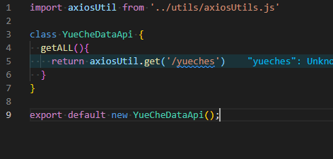

# 2021-2022学年第2学期
# **实 验 报 告**

- 课程名称:跨平台脚本开发技术  
- 实验项目:  期末大作业
- 专业班级__<u>计算机1904</u>_                      
- 学生学号__<u>31901123</u>_
- 学生姓名__<u>赵佳杰</u>_
- 实验指导教师:郭鸣

## 实验内容

1. 项目分工表格
    - 1人项目权重为1.0
    - 2人项目权重和为 1.9

    
    
    | 姓名 |学号 |班级 |任务|权重|
    |:--|:--:|--:|--:|--:|
    | 赵佳杰 | 31901123 | 计算机1904 |      | 1 |
    |  |  |  |||
    
1. 项目自我评估表

     

    | 技术点          | 自评等级:(1-5) | 备注 |
    |:--|:--:|---|
    | 响应式编程      |4| 前端数据会根据数据库数据更新 |
    | 函数式编程      |3|      |
    | xx 框架         |4| 使用express+sequelize框架 |
    
1. 项目说明

    1. 项目 是独立开发

        项目由node.js后端和vue前端组成，后端使用express框架，用sequelize框架实现对数据库操作，前端使用vue3，用js编写，部分使用了vant组件以及一些自制组件。

        **前端**

        首页轮播数据获取：

        

        个人界面获取头像：

        

        上传头像文件：

        

        约车界面获取剧本图片：

        

        剧本详情界面获取剧本剧情内容：

        

        剧本界面获取剧本基本内容：

        

        前端封装axios

        

        

        

        

        

        

        **后端：**

        

        

        controller：

        

        routes：

        

        model：

        

        index.js：

        

        

1. 解决技术要点说明
    
    数据库连接：

    
    
    sequelize建表：
    
    
    
    上传文件添加后缀并写入数据库：
    
    
    
1. 心得体会（结合自己情况具体说明）

     - 大项目开发过程心得
        
       不知道js后端从哪里下手开始做，通过B站学习。
       
       修改头像功能通过都组件文档以及搜索完成。
       
    - 本课程建议
        
        课程内容很详细，但需要自己更多的去课外学习，去实践。